<div align="center">
  <picture>
    <source media="(prefers-color-scheme: dark)" srcset="logo-escuro.png">
    
  </picture>
  <h1>PageLattes</h1>
  <p>Seu Currículo Lattes vira um site pessoal, publicado de graça no GitHub.</p>
  <p><strong><a href="https://luizpf42.github.io/PageLattes/">luizpf42.github.io/PageLattes</a></strong></p>
</div>

O GitHub, o site onde programadores guardam código, também hospeda páginas pessoais de graça: quem tem uma conta lá pode ter um site no endereço `seu-usuario.github.io`. O PageLattes transforma o seu Currículo Lattes em um arquivo único, pronto para ser colocado nesse lugar, e te orienta passo a passo até o site estar no ar.

Não precisa saber programar, não precisa instalar nada e não custa nada. O site fica assim, no computador e no celular:

<table>
  <tr>
    <td>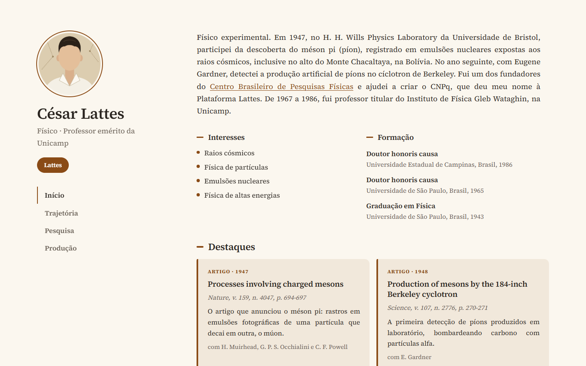</td>
    <td>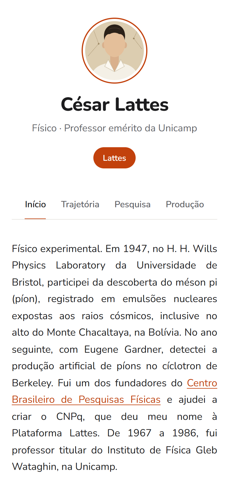</td>
  </tr>
</table>

O mesmo currículo, com outras escolhas de fundo, cor, fonte e estrutura:

<table>
  <tr>
    <td>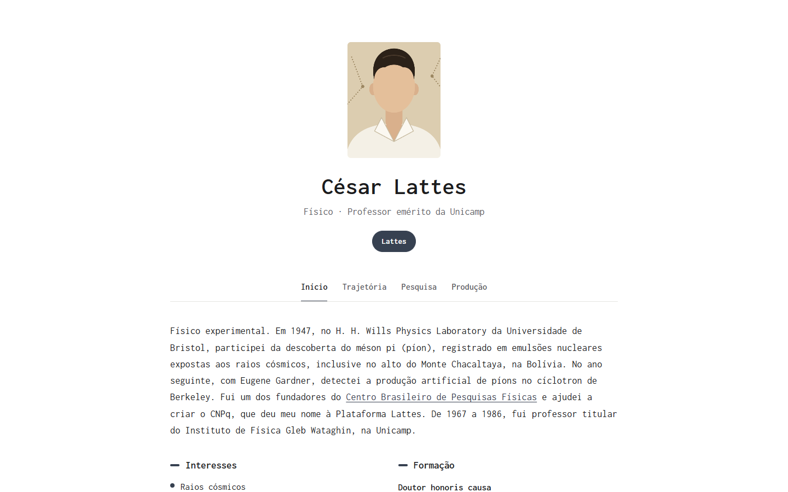</td>
    <td>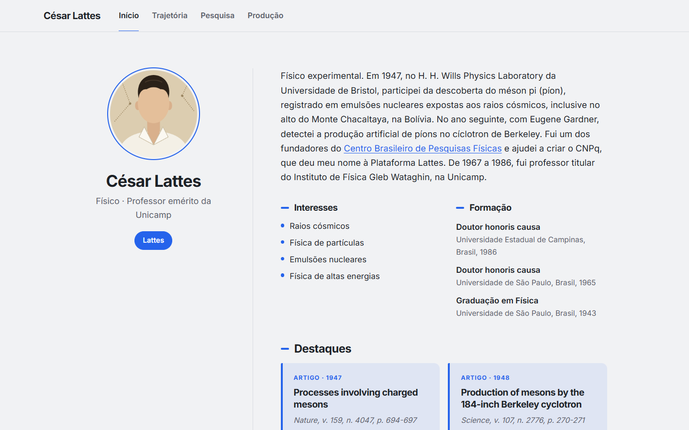</td>
    <td>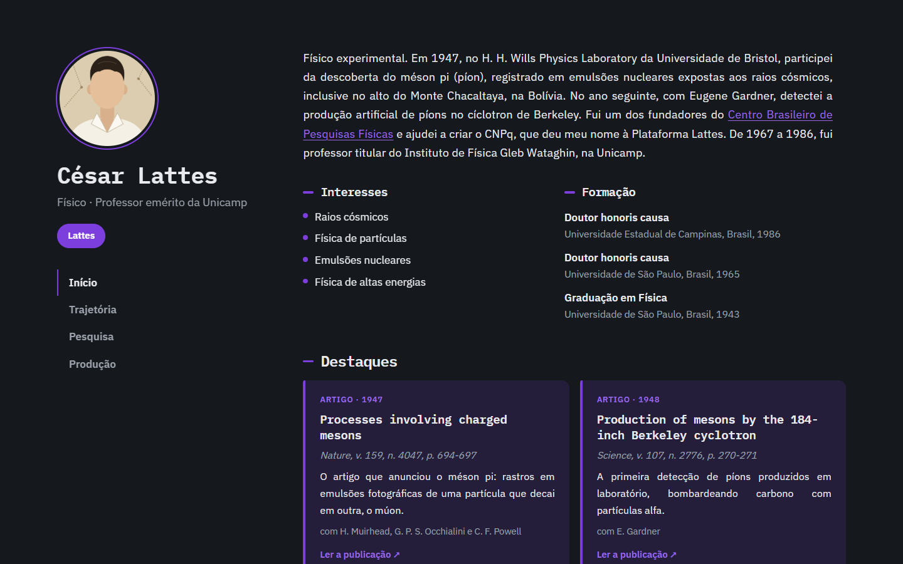</td>
  </tr>
</table>

<sub>O currículo de demonstração é uma homenagem a César Lattes (1924–2005), o físico que dá nome à Plataforma Lattes, no formato de um currículo de hoje, com o Lattes atualizado no dia em que ele morreu. Os dados são públicos: a trajetória vem da Wikipédia e as publicações foram conferidas no Crossref. O texto em primeira pessoa só reescreve esses fatos, e o avatar é um desenho, não uma foto dele.</sub>

## O que você precisa

- **Seu Currículo Lattes**, aberto no navegador. Quem não tem Lattes pode preencher tudo à mão.
- **Uma conta no GitHub.** É gratuita e leva dois minutos para criar. Você só precisa dela na última etapa.
- **Uns vinte minutos.** Tudo o que você faz fica salvo no seu navegador, então dá para parar e continuar depois.

## Como funciona

Abra [luizpf42.github.io/PageLattes](https://luizpf42.github.io/PageLattes/) e siga as cinco etapas.

### 1. Aparência

Escolha o fundo, a cor de destaque, a fonte, a estrutura da página e o formato da foto. A prévia ao lado muda na hora, e tudo pode ser trocado depois.

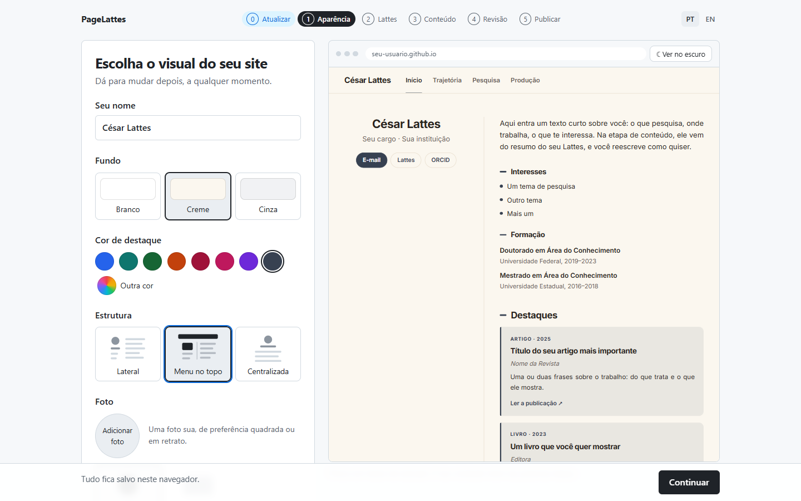

### 2. Lattes

Abra seu currículo na busca do Lattes, salve a página com <kbd>Ctrl</kbd> + <kbd>S</kbd> e arraste o arquivo salvo para o construtor. O currículo é lido ali mesmo, no seu navegador.

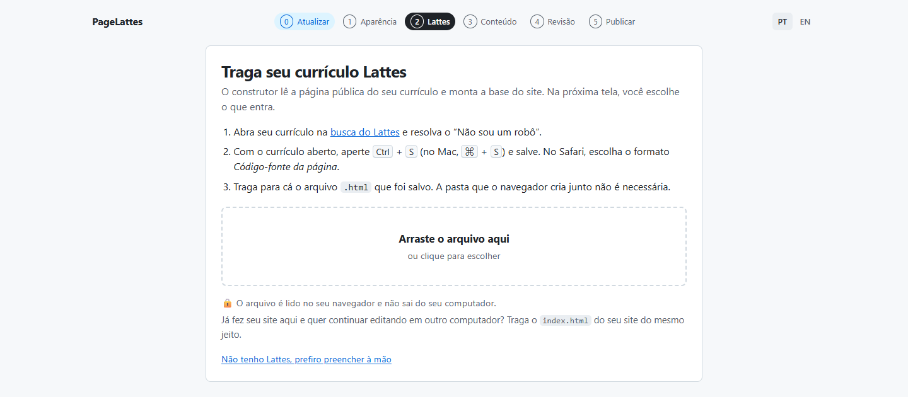

### 3. Conteúdo

O resumo do Lattes vira o texto de apresentação, que você reescreve como quiser. Depois, você escolhe o que entra no site, ajusta os interesses e marca com uma estrela o que merece aparecer em destaque na página inicial.

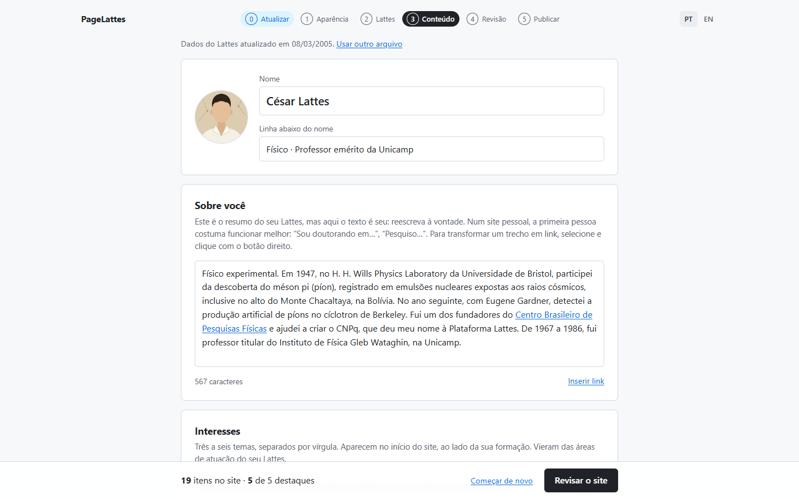

### 4. Revisão

Veja o site como ele vai ficar no celular, no tablet e no computador, e faça os ajustes finais de cor, fonte, foto e organização.

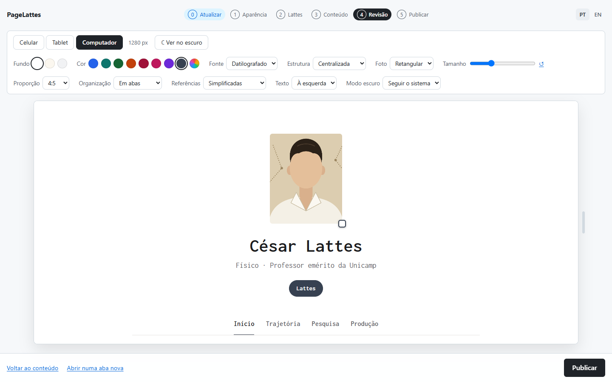

### 5. Publicar

Baixe o arquivo `index.html` e siga o passo a passo na tela: criar a conta, criar o repositório com o nome certo e enviar o arquivo. Em um ou dois minutos o site está no ar.

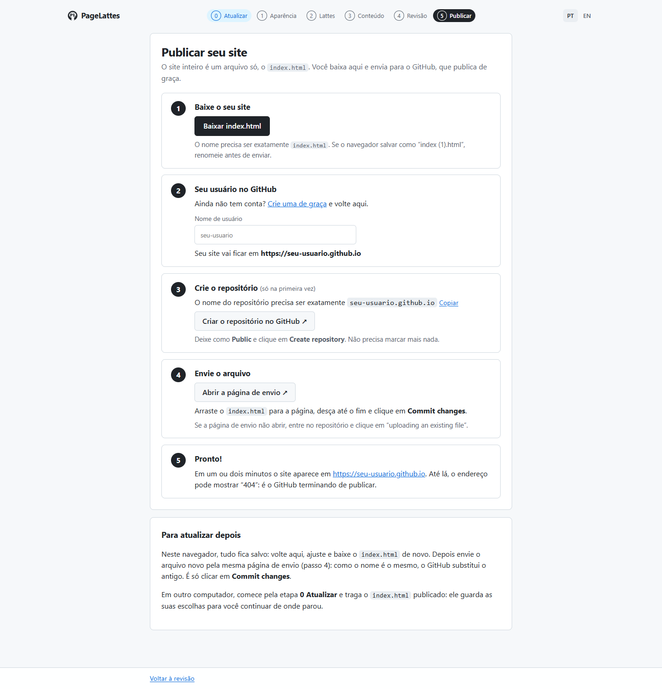

## Por que usar o Lattes?

O Lattes é uma fonte incomumente boa de registros. Quase toda pessoa que pesquisa no Brasil mantém o seu, ele é a referência para agências de fomento, concursos e programas de pós-graduação, e por isso costuma ser preenchido com cuidado. É um ativo da pesquisa e da academia brasileiras.

O que ele não faz é apresentar. A página pública do Lattes é feita para registrar: uma lista longa, igual para todo mundo, sem escolher o que vem primeiro nem como fica. O PageLattes acrescenta só uma camada de visibilidade e de flexibilidade na apresentação: você decide o que mostrar, o que destacar e com que cara.

Por isso ele não compete com o Lattes nem o substitui. **As produções continuam sendo cadastradas só no Lattes.** No site não se lança artigo, livro nem orientação à mão: se a lista fosse mantida em dois lugares, cedo ou tarde o site e o currículo iriam divergir. O que fica livre é o que o Lattes não cobre bem: a apresentação em primeira pessoa, os interesses, os links e os *destaques livres*, cartões para um software, um site, um projeto ou um prêmio que não têm registro no currículo.

## E para atualizar depois?

O site é um arquivo só, e esse arquivo guarda as suas escolhas: cores, textos, o que entrou e o que ficou de fora. Por isso o PageLattes consegue reler o site que ele mesmo gerou.

- **Mudou algo no Lattes?** Salve a página do currículo de novo e importe na etapa Lattes. As produções novas entram; o que você já tinha escolhido, escrito e destacado continua como estava.
- **Quer trocar a cor, mexer no texto ou tirar um item?** No mesmo navegador, está tudo salvo: abra o construtor, ajuste e baixe o `index.html` de novo. Em outro computador, comece pela etapa **0 Atualizar** e traga o `index.html` que está publicado no seu GitHub.
- **Para colocar no ar**, envie o arquivo novo pela mesma página do GitHub. Como o nome é o mesmo, ele entra no lugar do antigo.

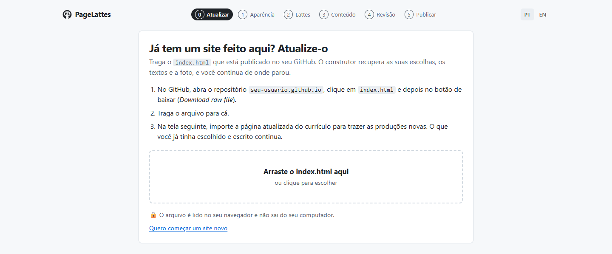

## Seus dados ficam com você

O construtor roda inteiro no seu navegador: o currículo, a foto e os textos não são enviados a servidor nenhum. O site mostra só o que já está público no seu Lattes, e só o que você escolheu mostrar.

O PageLattes é um projeto independente, sem vínculo com o CNPq ou com a Plataforma Lattes.

## Para quem programa

É um site estático, sem etapa de build e sem dependências: HTML, CSS e JavaScript puros. Para rodar localmente, sirva a pasta com qualquer servidor, por exemplo:

```
python -m http.server 8765
```

e abra `http://localhost:8765`.

### Onde está cada coisa

| Caminho | O que é |
| --- | --- |
| `index.html`, `css/construtor.css` | A casca do construtor. O visual é preto e branco de propósito, para não se confundir com as cores do site em construção. |
| `js/app.js` | As telas, o estado e o fluxo entre as etapas. O progresso fica no `localStorage`. |
| `js/lattes.js` | O leitor da página pública do Lattes. Foi construído e testado sobre páginas reais de currículos, de perfis variados. |
| `js/site.js` | Gera o HTML do site final. As escolhas vão embutidas num `<script type="application/json">`, que é o que a etapa Atualizar relê. |
| `js/tema.js` | Fundos, cores (com ajuste automático de contraste), fontes e estruturas. |
| `js/i18n.js` | O idioma da interface. |
| `fonts/` | As fontes, com as licenças ao lado. O site final embute só o par escolhido. |
| `prints/` | Os prints deste README e o script que os gera. |
| `parked/` | O que foi estacionado, com o motivo (veja abaixo). |

### Idiomas

O construtor está em português e em inglês (botões PT / EN no cabeçalho). Os textos são escritos em português no código; as traduções ficam em blocos `I18n.registrar` no início de cada módulo, e `js/i18n.js` explica o mecanismo. **O site gerado sai em português.**

> **Site em inglês: estacionado.** O construtor já gerou site em inglês e nos dois idiomas, com tradução por IA rodando dentro do navegador. Isso foi retirado em 2026-09-12 e está guardado em [`parked/`](parked/), com o código, o motivo e os números medidos em 214 currículos reais. Em resumo: rótulo e estrutura traduzem bem por regras, mas o conteúdo do Lattes não, e meia tradução é pior que nenhuma. Quem quiser retomar começa pelo [`parked/README.md`](parked/README.md).

### Refazer os prints

Os prints deste README saem de um roteiro em Puppeteer que percorre as etapas no Chrome já instalado no computador, com o currículo de demonstração escrito no próprio roteiro, onde estão também as fontes de cada dado. Cada print sai com um visual diferente. Com o construtor servido em `127.0.0.1:8765`:

```
cd prints
npm install
node gerar.js
```

### Fontes

As fontes em `fonts/` são distribuídas sob a SIL Open Font License; os textos das licenças estão na mesma pasta.

## Autoria

Idealizado por [Luiz Cláudio Pimenta Filho](https://github.com/LuizPF42) e escrito com o [Claude Code](https://claude.com/claude-code), da Anthropic.
